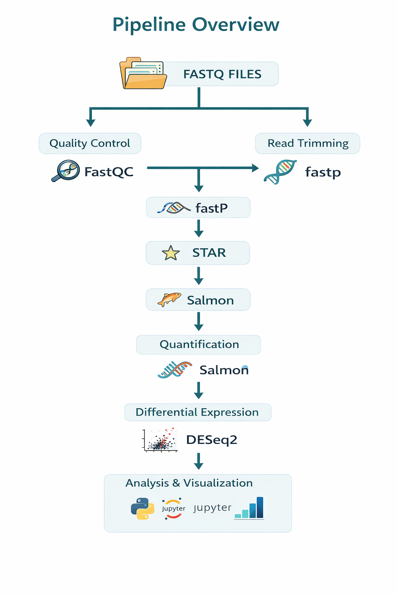

# TDP-43 RNA-seq Analysis

## Project Overview

TDP-43 is an RNA-binding protein involved in RNA processing and splicing regulation. Dysfunction and aggregation of TDP-43 have been linked to several neurodegenerative diseases, including amyotrophic lateral sclerosis (ALS) and frontotemporal dementia (FTD).

In this project, RNA sequencing (RNA-seq) data from **TDP-43 knockout (KO)** and **wild-type (WT)** human cells were analyzed to investigate transcriptomic changes associated with the loss of TDP-43 function.

The objective of this analysis is to process RNA-seq data, quantify transcript abundance, and explore gene expression differences between KO and WT samples.
A focused investigation was also performed on **chromosome 5** to explore transcriptomic patterns in this genomic region.

---

## RNA-seq Pipeline Overview


The RNA-seq workflow follows a standard transcriptomics pipeline executed in a Linux environment.

---

## Workflow Steps

1. **Data Preparation**

   * RNA-seq FASTQ files collected and organized
   * Subsampling performed for faster processing during development

2. **Quality Control**

   * Raw sequencing reads assessed for quality using **FastQC**

3. **Read Trimming**

   * Adapter sequences and low-quality bases removed using **fastp**

4. **Genome Alignment**

   * Reads aligned to the reference genome using **STAR**

5. **Transcript Quantification**

   * Gene and transcript abundance estimated using **Salmon**

6. **Differential Expression Analysis**

   * Expression differences analyzed using **DESeq2**

7. **Visualization and Analysis**

   * Exploratory data analysis performed using **Python and Jupyter Notebook**

---

## Tools Used

FastQC • fastp • SeqKit • STAR • samtools • Salmon • MultiQC • DESeq2 • ClusterProfiler • Python • Jupyter • seaborn • matplotlib

---

## Repository Structure

```
tdp43-rnaseq-analysis/
│
├── README.md
├── environment.yml
│
├── images/
│   └── rnaseq_pipeline.png
│
├── notebooks/
│   └── tdp43_analysis.ipynb
│
├── scripts/
│
├── data/
│   ├── raw_data/
│   ├── subsampled_data/
│   └── trimmed_data/
│
├── qc_reports/
├── alignment/
├── salmon_quant/
├── counts/
├── results/
├── references/
├── logs/
│
└── docs/
    ├── technical_report.pdf
    └── presentation.pptx
```

---

## Reproducibility

To recreate the computational environment:

```bash
conda env create -f environment.yml
conda activate rnaseq-analysis
jupyter lab
```

---

## Notes

Due to file size limitations, large sequencing datasets such as FASTQ files, BAM alignment files, and genome indexes may not be fully included in this repository. Instructions for obtaining these datasets are described in the pipeline scripts and analysis notebook.

---

## Author

**Mayar Mousa**
University of Jeddah
Data Science

Yara Alghamdi
King Abdulaziz university
Plant Science
